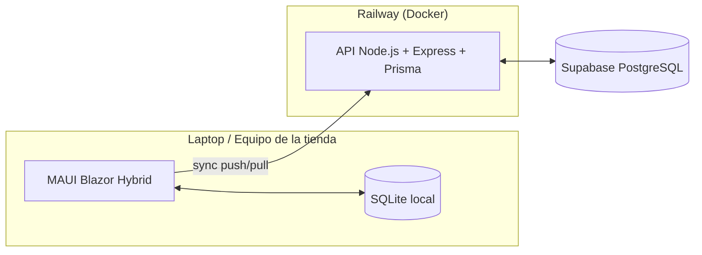

# StockBridge

**Sistema de Gestión de Inventario y Ventas Fuera de Línea** — aplicación híbrida escritorio + nube para tiendas locales que necesitan seguir vendiendo aunque se caiga el internet.

> El nombre viene de eso: un *bridge* entre lo que pasa en el mostrador (offline, local, inmediato) y lo que vive en la nube (sincronizado, centralizado, eventual).

**Versión actual: v2** — usuarios con roles (cajero, gerente, dueño). Backend desplegado en Railway sobre Supabase.

---

## 🧩 El problema

Las tiendas locales dependen de internet para sus sistemas de punto de venta, pero el internet no siempre está ahí. Cuando se cae, el negocio no debería detenerse. StockBridge deja que la tienda siga operando 100% offline (inventario, ventas y acceso de empleados) y sincroniza todo automáticamente en cuanto la conexión regresa.

## ✅ Qué demuestra este proyecto

- Sincronización de datos entre un cliente **offline-first** y un backend central.
- Manejo de estado local persistente y resiliente a fallos de red.
- Resolución de conflictos en escritura concurrente entre dispositivos (*last-write-wins*).
- Idempotencia: una operación reenviada por una conexión caída no se duplica.
- Control de acceso por roles que también funciona sin conexión.
- Arquitectura básica de un sistema distribuido, contenerizado y desplegado.

## 🏗️ Arquitectura



📄 Documentación completa (requisitos, modelo de datos, roles, diagramas de secuencia y estados): [`docs/arquitectura.md`](./docs/arquitectura.md)

## 🖥️ La app

- **Login por PIN** — cada empleado entra con su usuario y un PIN de 4 dígitos, en cada apertura de la app. Botón de "Cerrar sesión" para cambios de turno.
- **Productos** — alta, edición de precio, adición de stock (acumulativa), baja, y badges de nivel de inventario (ok / bajo / agotado).
- **Ventas** — carrito con varios productos por venta, método de pago (efectivo / transferencia / tarjeta), historial agrupado por ticket con detalle expandible.
- **Usuarios** — alta de empleados con su rol (solo dueño).
- Barra de estado de sincronización siempre visible, con indicador de color y botón de "Sincronizar ahora".

### Roles y permisos

| Acción | Cajero | Gerente | Dueño |
|--------|:------:|:-------:|:-----:|
| Registrar ventas | ✅ | ✅ | ✅ |
| Ver inventario | ✅ | ✅ | ✅ |
| Agregar stock a un producto existente | — | ✅ | ✅ |
| Crear productos nuevos | — | — | ✅ |
| Editar precio de productos | — | — | ✅ |
| Eliminar productos | — | — | ✅ |
| Dar de alta empleados | — | — | ✅ |

La jerarquía es cajero ⊂ gerente ⊂ dueño. El primer usuario que se crea en una tienda es el dueño (configuración inicial). Los permisos se aplican en dos capas: la interfaz oculta lo que no corresponde al rol, y cada acción vuelve a validar el rol antes de guardar.

## 🛠️ Stack

| Capa | Tecnología |
|------|-----------|
| Cliente escritorio | .NET MAUI Blazor Hybrid (.NET 10) |
| Almacenamiento local | SQLite |
| Backend | Node.js + Express + Prisma |
| Base de datos en la nube | PostgreSQL (Supabase) |
| Contenerización | Docker |
| Hosting del API | Railway |

## 📂 Estructura del repo

```
StockBridge/
├── client/
│   └── StockBridge.Client/      # App .NET MAUI Blazor Hybrid
│       ├── Data/                 # Modelos SQLite + LocalDatabase (acceso local)
│       ├── Services/             # SyncService, ApiSyncClient, SessionService (roles)
│       ├── Components/           # Login, layout y páginas Blazor (Productos, Ventas, Usuarios)
│       └── Utils/                # Formato de moneda, hash de PIN
├── backend/
│   ├── src/
│   │   ├── routes/sync.js        # POST /sync/push, GET /sync/pull
│   │   └── middleware/auth.js    # Auth por bearer token
│   ├── prisma/schema.prisma      # Modelo de datos (Postgres)
│   └── Dockerfile
├── docs/
│   └── arquitectura.md           # Especificación completa
└── README.md
```

## 🗄️ Modelo de datos (resumen)

- **Producto** — SKU, nombre, precio, stock, borrado lógico.
- **VentaTicket** — el "recibo": fecha, método de pago, total. Agrupa una o varias líneas.
- **DetalleVenta** — una línea dentro de un ticket: producto, cantidad, precio unitario, subtotal.
- **Usuario** — nombre, rol y hash del PIN (el PIN nunca se guarda ni se sincroniza en claro).

Cada tabla de negocio lleva `updated_at` y `device_id` para la sincronización.

## 🚀 Cómo correrlo local

**Backend:**
```
cd backend
npm install
cp .env.example .env   # DATABASE_URL de Supabase (Session pooler) y un API_TOKEN
npx prisma migrate dev
npm run dev
```

**Cliente:** abre `client/StockBridge.Client/StockBridge.Client.csproj` en Visual Studio 2022 con el workload de .NET MAUI, selecciona "Windows Machine" y dale Run. En `AppConfig.cs` define la URL del API (localhost o la URL pública de Railway) y el mismo `API_TOKEN` del backend.

**Ejecutable sin Visual Studio** (opcional), desde `client\StockBridge.Client`:
```
dotnet publish StockBridge.Client.csproj -f net10.0-windows10.0.19041.0 -c Release -p:WindowsPackageType=None -p:SelfContained=true -p:RuntimeIdentifierOverride=win-x64
```

## ⚠️ Limitaciones conocidas

- Los permisos por rol se aplican en el cliente. El backend confía en cualquier cliente que tenga el token de la API; no verifica el rol del usuario.
- La API se protege con un token compartido, no con autenticación por usuario.
- El PIN es de 4 dígitos y se guarda con SHA-256 sin sal: suficiente para separar accesos dentro de una tienda, no para protegerse de alguien con acceso a la base de datos.
- Resolución de conflictos por *last-write-wins*: dos ediciones casi simultáneas del mismo registro pueden perder la más antigua.

## 📌 Estado del proyecto

**v1**
- [x] Arquitectura y diagramas definidos
- [x] API de sincronización (`/sync/push`, `/sync/pull`) con idempotencia y last-write-wins
- [x] Cliente MAUI con SQLite local, `sync_queue` y sincronización automática por conectividad
- [x] Productos y ventas (tickets con varias líneas, método de pago)
- [x] Diseño de UI
- [x] Deploy del backend en Railway + Supabase, cliente apuntando a producción

**v2**
- [x] Usuarios con roles (cajero, gerente, dueño) y login por PIN
- [x] Usuarios sincronizados entre dispositivos
- [x] Login que sincroniza antes de ofrecer la configuración inicial en un equipo nuevo
