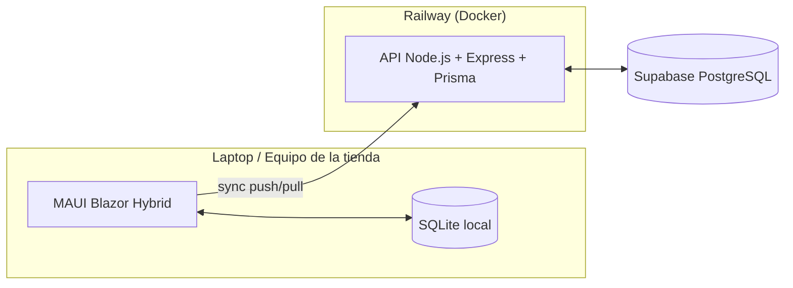

# StockBridge

**Sistema de Gestión de Inventario y Ventas Fuera de Línea** — aplicación híbrida escritorio + nube para tiendas locales que necesitan seguir vendiendo aunque se caiga el internet.

> El nombre viene de eso: un *bridge* entre lo que pasa en el mostrador (offline, local, inmediato) y lo que vive en la nube (sincronizado, centralizado, eventual).

---

## 🧩 El problema

Las tiendas locales dependen de internet para sus sistemas de punto de venta, pero el internet no siempre está ahí. Cuando se cae, el negocio no debería detenerse — StockBridge deja que la tienda siga operando 100% offline (inventario y ventas) y sincroniza todo automáticamente en cuanto la conexión regresa.

## ✅ Qué demuestra este proyecto

- Sincronización de datos entre un cliente **offline-first** y un backend central.
- Manejo de estado local persistente y resiliente a fallos de red.
- Resolución de conflictos en escritura concurrente entre dispositivos (*last-write-wins*).
- Idempotencia: una operación reenviada por una conexión caída no se duplica.
- Arquitectura básica de un sistema distribuido, contenerizado y desplegable.

## 🏗️ Arquitectura



📄 Documentación completa de arquitectura, requisitos, modelo de datos y diagramas de secuencia/estados: [`docs/arquitectura.md`](./docs/arquitectura.md)

## 🖥️ La app

- **Productos** — alta, edición de precio, adición de stock (acumulativo), badges de nivel de inventario (ok / bajo / agotado).
- **Ventas** — carrito con varios productos por venta, selector de método de pago (efectivo / transferencia / tarjeta), historial agrupado por ticket con detalle expandible.
- Barra de estado de sincronización siempre visible, con indicador de color y botón de "Sincronizar ahora".

## 🛠️ Stack

| Capa | Tecnología |
|------|-----------|
| Cliente escritorio | .NET MAUI Blazor Hybrid (.NET 10) |
| Almacenamiento local | SQLite |
| Backend | Node.js + Express + Prisma |
| Base de datos en la nube | PostgreSQL (Supabase) |
| Contenerización | Docker |
| Hosting del API | Railway |

## 📂 Estructura del repo

```
StockBridge/
├── client/
│   └── StockBridge.Client/     # App .NET MAUI Blazor Hybrid
│       ├── Data/                # Modelos SQLite + LocalDatabase (acceso local)
│       ├── Services/             # SyncService, ApiSyncClient, DTOs
│       ├── Components/           # Layout + páginas Blazor (Productos, Ventas)
│       └── Utils/                 # Helpers (formato de moneda, etc.)
├── backend/
│   ├── src/
│   │   ├── routes/sync.js        # POST /sync/push, GET /sync/pull
│   │   └── middleware/auth.js    # Auth por bearer token
│   └── prisma/schema.prisma      # Modelo de datos (Postgres)
├── docs/
│   └── arquitectura.md           # Especificación completa
└── README.md
```

## 🗄️ Modelo de datos (resumen)

- **Producto** — SKU, nombre, precio, stock, borrado lógico.
- **VentaTicket** — el "recibo": fecha, método de pago, total. Agrupa una o varias líneas.
- **DetalleVenta** — una línea dentro de un ticket: producto, cantidad, precio unitario, subtotal.

Cada tabla de negocio lleva `updated_at` y `device_id` para la sincronización.

## 🚀 Cómo correrlo local

**Backend:**
```
cd backend
npm install
cp .env.example .env   # pega tu DATABASE_URL de Supabase (Session pooler) y define un API_TOKEN
npx prisma migrate dev --name init
npm run dev
```

**Cliente:** abre `client/StockBridge.Client/StockBridge.Client.csproj` en Visual Studio 2022 con el workload de .NET MAUI instalado, selecciona el target "Windows Machine" y dale Run. El `AppConfig.cs` debe apuntar al mismo `API_TOKEN` que el backend.

## 📌 Estado del proyecto

- [x] Arquitectura y diagramas definidos
- [x] Esquema de Prisma + migraciones (Producto, VentaTicket, DetalleVenta)
- [x] API de sincronización (`/sync/push`, `/sync/pull`) con idempotencia y last-write-wins
- [x] Esquema de SQLite local + `sync_queue`
- [x] Cliente MAUI Blazor Hybrid — Productos y Ventas funcionales
- [x] Flujo completo offline → online validado end-to-end contra Supabase
- [x] Diseño de UI (sidebar, sistema de tokens, tipografía monoespaciada para números)
- [x] Deploy del backend en Railway con URL pública
- [x] Apuntar el cliente a la URL de producción
