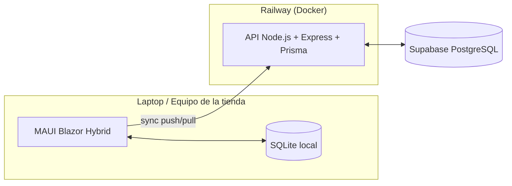

# StockBridge

**Sistema de Gestión de Inventario y Ventas Fuera de Línea** — aplicación híbrida escritorio + nube para tiendas locales que necesitan seguir vendiendo aunque se caiga el internet.

> El nombre viene de eso: un *bridge* entre lo que pasa en el mostrador (offline, local, inmediato) y lo que vive en la nube (sincronizado, centralizado, eventual).

---

## 🧩 El problema

Las tiendas locales dependen de internet para sus sistemas de punto de venta, pero el internet no siempre está ahí. Cuando se cae, el negocio no debería detenerse — StockBridge deja que la tienda siga operando 100% offline y sincroniza todo automáticamente en cuanto la conexión regresa.

## ✅ Qué demuestra este proyecto

- Sincronización de datos entre un cliente **offline-first** y un backend central.
- Manejo de estado local persistente y resiliente a fallos de red.
- Resolución de conflictos en escritura concurrente entre dispositivos.
- Arquitectura básica de un sistema distribuido, contenerizado y desplegable.

## 🏗️ Arquitectura



📄 Documentación completa de arquitectura, requisitos, ERD y diagramas de secuencia/estados: [`docs/arquitectura.md`](./docs/arquitectura.md)

## 🛠️ Stack

| Capa | Tecnología |
|------|-----------|
| Cliente escritorio | .NET MAUI Blazor Hybrid |
| Almacenamiento local | SQLite |
| Backend | Node.js + Express + Prisma |
| Base de datos en la nube | PostgreSQL (Supabase) |
| Contenerización | Docker |
| Hosting del API | Railway |

## 📂 Estructura del repo

```
StockBridge/
├── client/          # App .NET MAUI Blazor Hybrid
├── backend/         # API Node.js + Express + Prisma
│   ├── src/
│   └── prisma/
├── docs/            # Documentación de arquitectura y diagramas
└── README.md
```

## 🚀 Estado del proyecto

- [x] Arquitectura y diagramas definidos
- [ ] Esquema de Prisma + migraciones
- [ ] API de sincronización (`/sync/push`, `/sync/pull`)
- [ ] Esquema de SQLite local + tabla `sync_queue`
- [ ] Cliente MAUI Blazor Hybrid
- [ ] Deploy en Railway + Supabase

## 👩‍💻 Autora

Proyecto de Ale — Ingeniería en Software.
