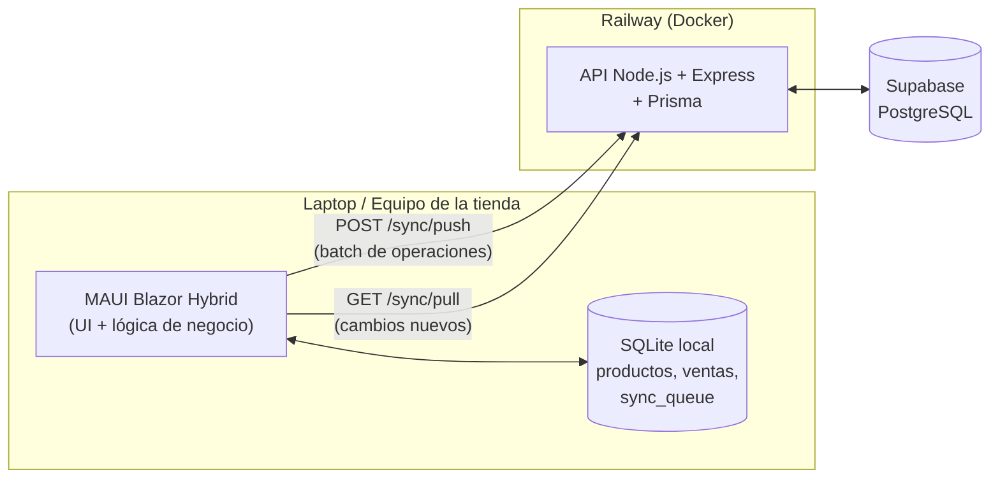
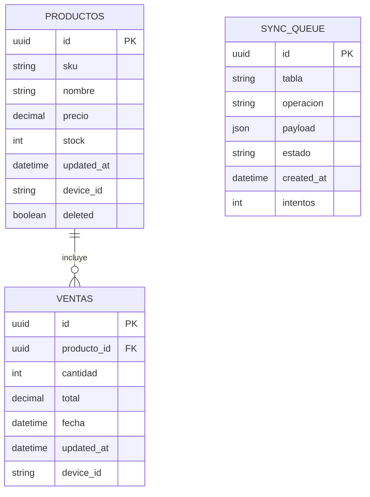
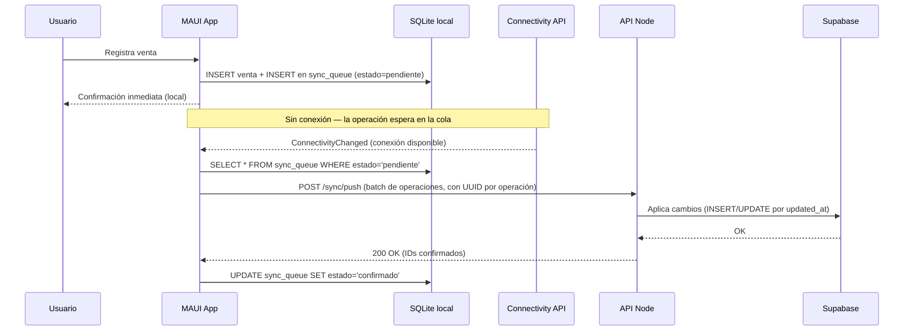
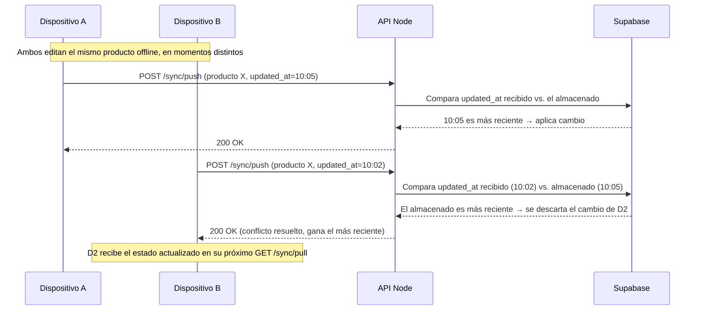
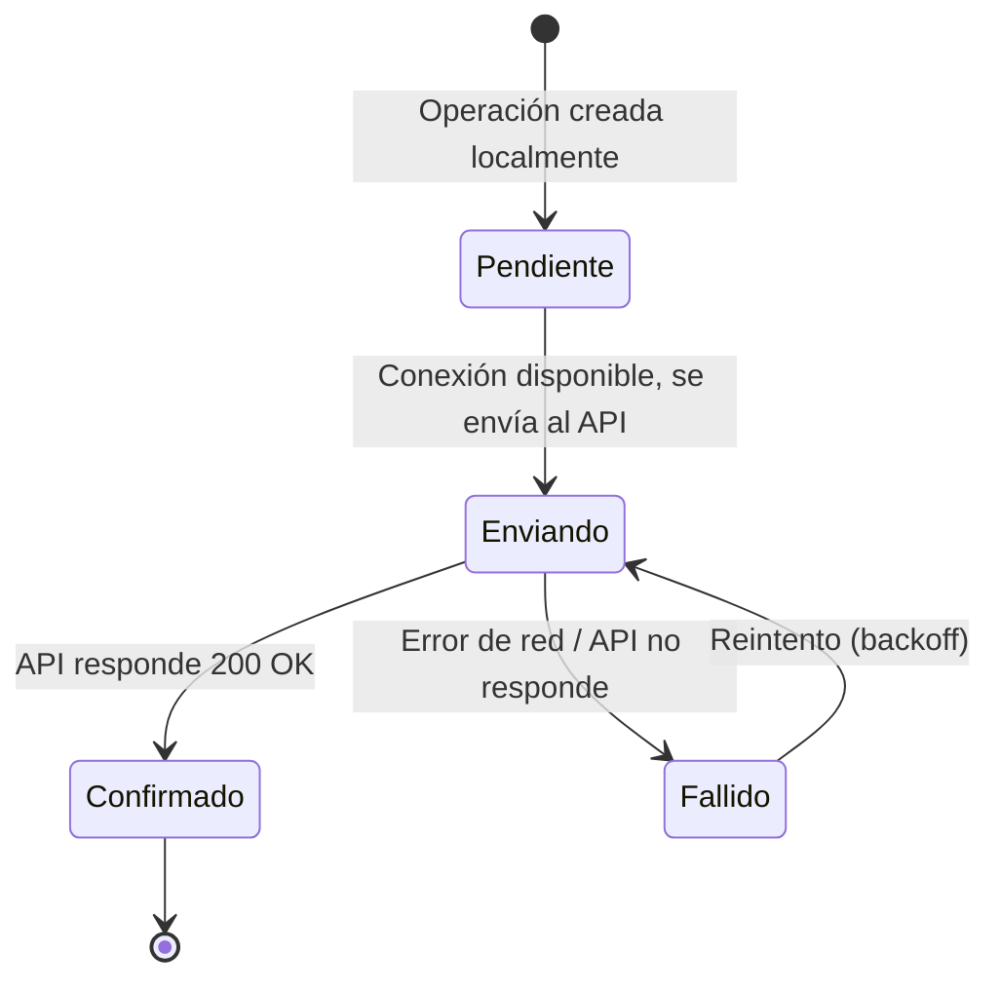
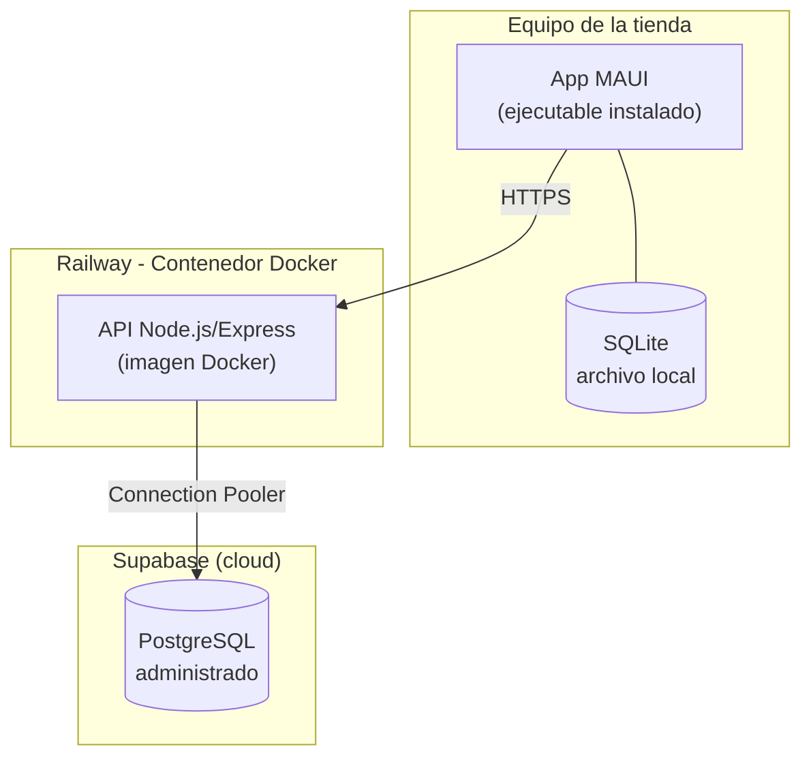

# Sistema de Gestión de Inventario y Ventas Fuera de Línea
### Documento de Especificación de Arquitectura

---

## 1. Introducción y Objetivo

Sistema híbrido escritorio + nube para tiendas locales que necesitan seguir operando (registrar ventas, consultar/ajustar inventario) aunque no tengan conexión a internet. Cuando la conexión regresa, los cambios locales se sincronizan automáticamente con una base de datos central en la nube.

El objetivo técnico del proyecto es demostrar:
- Sincronización de datos entre un cliente offline-first y un backend central.
- Manejo de estado local persistente y resiliente a fallos de red.
- Arquitectura básica de un sistema distribuido con resolución de conflictos.

---

## 2. Alcance (MVP)

**Incluido:**
- CRUD de productos (alta, edición, consulta, baja lógica).
- Registro de ventas (con descuento automático de stock).
- Funcionamiento 100% offline para ambas operaciones.
- Sincronización automática al detectar conexión.
- Resolución de conflictos por *last-write-wins*.

**Fuera de alcance (por ahora):**
- Multi-tienda / multi-sucursal con roles y permisos.
- Reportes avanzados o dashboards analíticos.
- Autenticación de usuarios robusta (se usa un token simple).

---

## 3. Requisitos Funcionales

| ID | Requisito |
|----|-----------|
| RF-01 | El usuario puede crear, editar y consultar productos sin conexión a internet. |
| RF-02 | El usuario puede registrar una venta sin conexión; el stock se descuenta localmente. |
| RF-03 | El sistema detecta automáticamente cuándo hay conexión disponible. |
| RF-04 | El sistema sincroniza automáticamente las operaciones pendientes al recuperar conexión. |
| RF-05 | El sistema resuelve conflictos de escritura concurrente (mismo registro editado en dos dispositivos) sin intervención manual. |
| RF-06 | El sistema no duplica operaciones si una sincronización se reintenta tras una falla parcial (idempotencia). |

## 4. Requisitos No Funcionales

| ID | Requisito |
|----|-----------|
| RNF-01 | La app debe responder de forma local (sin esperar red) para toda operación de negocio. |
| RNF-02 | La cola de sincronización debe sobrevivir a un cierre inesperado de la app (persistida en disco, no en memoria). |
| RNF-03 | El sistema debe reintentar sincronizaciones fallidas sin perder datos. |
| RNF-04 | El backend debe ser desplegable de forma reproducible (Docker). |

---

## 5. Stack Tecnológico

| Capa | Tecnología | Motivo |
|------|-----------|--------|
| Cliente escritorio | .NET MAUI Blazor Hybrid | Un solo lenguaje (C#) de punta a punta, sin necesidad de un bridge nativo↔JS. |
| Almacenamiento local | SQLite (`Microsoft.Data.Sqlite`) | Estándar para persistencia local embebida, transaccional. |
| Backend / API | Node.js + Express | Rápido de levantar, suficiente para el alcance del reto. |
| ORM backend | Prisma | Migraciones versionadas + types automáticos. |
| Base de datos en la nube | PostgreSQL (hosteado en Supabase) | Administrado, gratuito para este alcance, connection pooling incluido. |
| Contenerización | Docker | Despliegue reproducible del API. |
| Hosting del API | Railway | Deploy directo desde Dockerfile + repo de GitHub, URL pública gratis. |

---

## 6. Arquitectura de Contenedores

---

## 7. Modelo de Datos (ERD)

**Notas de diseño:**
- `device_id` en cada registro de negocio identifica qué dispositivo hizo el último cambio — necesario para resolver conflictos.
- `updated_at` es el criterio de *last-write-wins*.
- `deleted` como borrado lógico en vez de `DELETE` físico, para que el borrado también se pueda sincronizar.
- `sync_queue.id` se genera como UUID en el cliente y viaja como identificador de idempotencia al backend.

---

## 8. Flujo de Sincronización (Diagrama de Secuencia)

**Caso normal — offline a online:**

**Caso de conflicto — mismo producto editado en dos dispositivos:**

---

## 9. Ciclo de Vida de una Operación de Sincronización (Diagrama de Estados)

---

## 10. Diagrama de Despliegue

---

## 11. Estrategia de Resolución de Conflictos

- **Regla:** *Last-write-wins* basado en `updated_at`.
- **Justificación:** para el alcance del MVP (una tienda, pocos dispositivos), es simple de implementar y de explicar, y cubre el caso principal sin necesitar CRDTs o vector clocks.
- **Idempotencia:** cada operación en `sync_queue` lleva un UUID generado en el cliente; el API lo usa para detectar reenvíos duplicados (por ejemplo, si la conexión se cae a medio POST) y no aplicar el cambio dos veces.
- **Limitación conocida (a mencionar si preguntan en la evaluación):** last-write-wins puede perder cambios legítimos si dos ediciones son casi simultáneas. Se documenta como decisión consciente de alcance, no como descuido.

---

## 12. Próximos Pasos

1. Validar este documento (ajustar campos del ERD, nombres, si falta algo).
2. Crear repositorio(s) de Git (backend y cliente, o monorepo — pendiente decidir).
3. Levantar el proyecto de API (Express + Prisma + Dockerfile) contra Supabase.
4. Levantar el proyecto MAUI Blazor Hybrid con el esquema de SQLite y la tabla `sync_queue`.
5. Implementar el flujo de sincronización descrito en la Sección 8.
