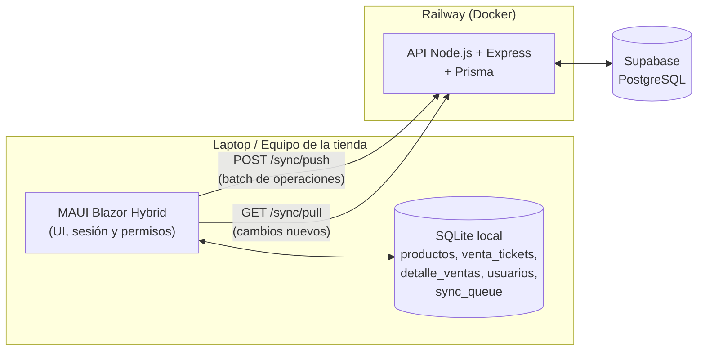
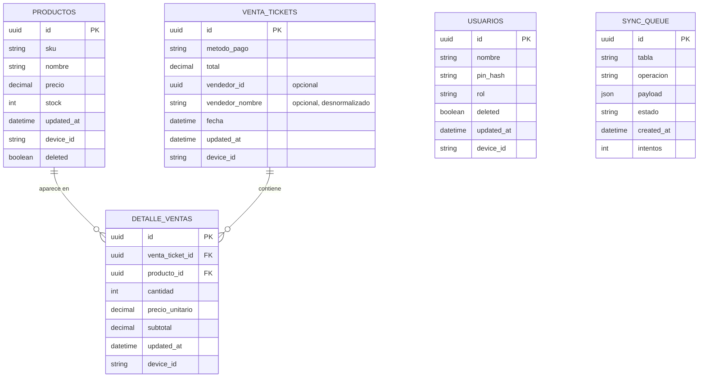
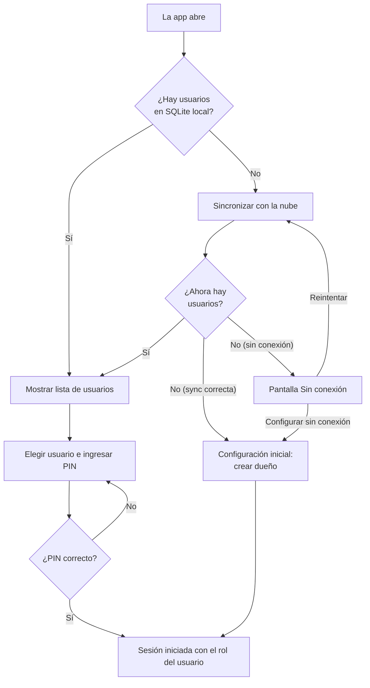
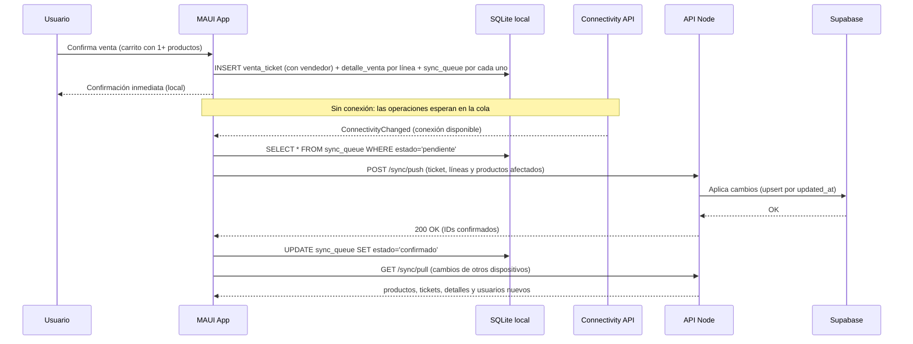
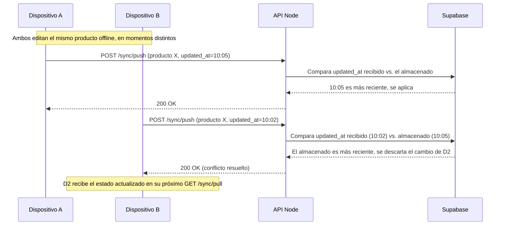
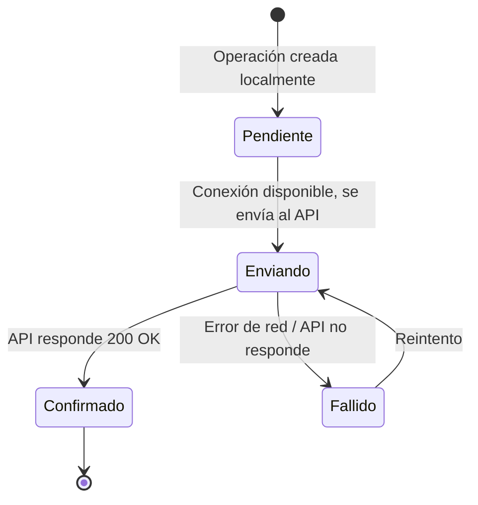
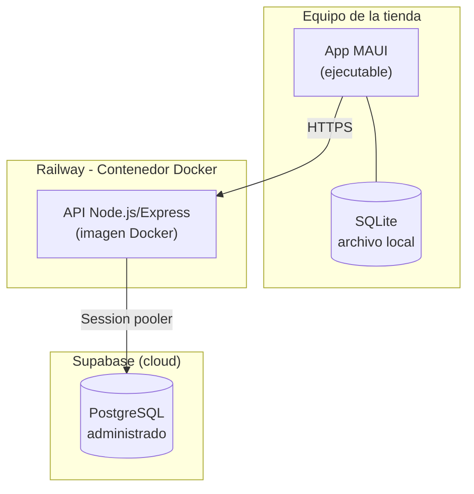

# Sistema de Gestión de Inventario y Ventas Fuera de Línea
### Documento de Especificación de Arquitectura — v2 (cerrada)

---

## 1. Introducción y Objetivo

Sistema híbrido escritorio + nube para tiendas locales que necesitan seguir operando (registrar ventas, consultar y ajustar inventario, identificar a sus empleados) aunque no tengan conexión a internet. Cuando la conexión regresa, los cambios locales se sincronizan automáticamente con una base de datos central en la nube.

El objetivo técnico del proyecto es demostrar:
- Sincronización de datos entre un cliente offline-first y un backend central.
- Manejo de estado local persistente y resiliente a fallos de red.
- Arquitectura básica de un sistema distribuido con resolución de conflictos.
- Control de acceso por roles que funciona también sin conexión.

---

## 2. Alcance

**Incluido (v1):**
- CRUD de productos (alta, edición de precio, adición de stock, baja lógica).
- Registro de ventas con varios productos por venta (carrito), agrupados en un ticket.
- Método de pago por venta (efectivo, transferencia, tarjeta).
- Funcionamiento 100% offline para todo lo anterior.
- Sincronización automática al detectar conexión, con resolución de conflictos por *last-write-wins*.
- Backend desplegado en la nube.

**Incluido (v2):**
- Usuarios con tres roles: cajero, gerente y dueño.
- Login por PIN en cada apertura de la app, con opción de cerrar sesión.
- Alta, edición y eliminación de empleados por parte del dueño.
- Usuarios sincronizados entre dispositivos.
- Cada venta registra qué empleado la realizó.
- Guardarraíles: no se puede eliminar la propia cuenta con sesión activa, ni dejar la tienda sin un dueño.

**Fuera de alcance (por ahora):**
- Multi-tienda / multi-sucursal.
- Reportes avanzados o dashboards analíticos.
- Autenticación de la API por usuario (se usa un token compartido).

---

## 3. Requisitos Funcionales

| ID | Requisito |
|----|-----------|
| RF-01 | El usuario puede crear, editar (precio) y consultar productos sin conexión a internet. |
| RF-02 | El usuario puede agregar stock a un producto existente (operación acumulativa, no de reemplazo). |
| RF-03 | El usuario puede armar una venta con uno o varios productos (carrito) antes de confirmarla. |
| RF-04 | Cada venta registra un método de pago (efectivo, transferencia o tarjeta). |
| RF-05 | Al confirmar una venta, el stock de cada producto involucrado se descuenta localmente. |
| RF-06 | El sistema detecta automáticamente cuándo hay conexión disponible. |
| RF-07 | El sistema sincroniza automáticamente las operaciones pendientes al recuperar conexión. |
| RF-08 | El sistema resuelve conflictos de escritura concurrente sin intervención manual. |
| RF-09 | El sistema no duplica operaciones si una sincronización se reintenta tras una falla parcial (idempotencia). |
| RF-10 | El historial de ventas se muestra agrupado por ticket, con el detalle de productos al expandir. |
| RF-11 | Para usar la app, el empleado se identifica eligiendo su usuario e ingresando un PIN de 4 dígitos, en cada apertura. |
| RF-12 | El usuario puede cerrar sesión sin cerrar la app (cambio de turno). |
| RF-13 | Cada usuario tiene un rol (cajero, gerente o dueño) que determina qué acciones puede realizar (ver sección 8). |
| RF-14 | El dueño puede dar de alta empleados asignándoles nombre, rol y PIN. |
| RF-15 | En una instalación nueva sin usuarios, el primer usuario creado se convierte automáticamente en dueño. |
| RF-16 | Los usuarios se sincronizan entre dispositivos: un empleado dado de alta en un equipo puede iniciar sesión en otro. |
| RF-17 | En un equipo sin usuarios locales, el sistema intenta sincronizar antes de ofrecer la configuración inicial, para no crear un segundo dueño si ya existe uno en la nube. |
| RF-18 | Cada venta registrada queda asociada al usuario que la hizo (nombre y ID). |
| RF-19 | El dueño puede editar el nombre, el rol y (opcionalmente) el PIN de un empleado existente. |
| RF-20 | El dueño puede eliminar (baja lógica) a un empleado. |
| RF-21 | No se permite eliminar la cuenta con la que se tiene sesión iniciada. |
| RF-22 | No se permite eliminar al último dueño activo, ni cambiarle el rol a otro que no sea dueño, si es el único que queda. |

## 4. Requisitos No Funcionales

| ID | Requisito |
|----|-----------|
| RNF-01 | La app debe responder de forma local (sin esperar red) para toda operación de negocio, incluido el login. |
| RNF-02 | La cola de sincronización debe sobrevivir a un cierre inesperado de la app (persistida en disco). |
| RNF-03 | El sistema debe reintentar sincronizaciones fallidas sin perder datos. |
| RNF-04 | El backend debe ser desplegable de forma reproducible (Docker). |
| RNF-05 | Los errores de sincronización se muestran en lenguaje claro para el usuario final, no como excepciones técnicas. |
| RNF-06 | No se permiten valores negativos en precio ni en stock. |
| RNF-07 | El PIN nunca se almacena ni se sincroniza en claro; solo su hash. |
| RNF-08 | Los permisos por rol se validan en dos capas: la interfaz oculta lo no permitido y cada acción vuelve a validar el rol antes de ejecutarse. |
| RNF-09 | Los tickets de venta creados antes de que existiera el campo "vendedor" siguen siendo válidos (campo opcional, no rompe datos históricos). |

---

## 5. Stack Tecnológico

| Capa | Tecnología | Motivo |
|------|-----------|--------|
| Cliente escritorio | .NET MAUI Blazor Hybrid (.NET 10) | Un solo lenguaje (C#) de punta a punta, sin puente nativo↔JS. |
| Almacenamiento local | SQLite (`sqlite-net-pcl`) | Persistencia local embebida y transaccional. |
| Backend / API | Node.js + Express | Rápido de levantar, suficiente para el alcance. |
| ORM backend | Prisma | Migraciones versionadas y tipos automáticos. |
| Base de datos en la nube | PostgreSQL en Supabase (Session pooler) | Administrado; el Session pooler funciona por IPv4 y soporta migraciones. |
| Contenerización | Docker (`node:20-alpine`) | Despliegue reproducible; incluye OpenSSL para el motor de Prisma. |
| Hosting del API | Railway | Deploy desde el Dockerfile y el repositorio de GitHub. |

---

## 6. Arquitectura de Contenedores

---

## 7. Modelo de Datos (ERD)

Una venta se modela como un **ticket** (encabezado) con una o varias **líneas de detalle**, una por producto, igual que un recibo real. El ticket también guarda quién la vendió. Los usuarios se guardan en su propia tabla, con borrado lógico igual que productos.

**Notas de diseño:**
- `device_id` en cada registro identifica qué dispositivo hizo el último cambio.
- `updated_at` es el criterio de *last-write-wins*.
- `deleted` es borrado lógico en `productos` y en `usuarios`, para que el borrado también se pueda sincronizar.
- `sync_queue.id` se genera como UUID en el cliente y viaja como identificador de idempotencia al backend, para todas las tablas.
- `metodo_pago` vive en el ticket porque una venta tiene un solo método de pago; `vendedor_id`/`vendedor_nombre` igual, uno por ticket.
- `vendedor_id`/`vendedor_nombre` son opcionales a propósito: los tickets creados antes de este campo no tienen esa información y siguen siendo válidos. El nombre se guarda desnormalizado (tal cual estaba al momento de la venta) para que el historial no cambie si luego se edita o elimina al empleado.
- `usuarios.rol` toma los valores `cajero`, `gerente` o `dueno`.
- `usuarios.pin_hash` es el hash SHA-256 del PIN, calculado en el cliente. El servidor lo almacena como cualquier otro campo y nunca ve el PIN.
- Tablas sincronizadas: `productos`, `venta_tickets`, `detalle_ventas` y `usuarios`.

---

## 8. Usuarios, Roles y Permisos

### 8.1 Matriz de permisos

| Acción | Cajero | Gerente | Dueño |
|--------|:------:|:-------:|:-----:|
| Registrar ventas | ✅ | ✅ | ✅ |
| Ver inventario | ✅ | ✅ | ✅ |
| Agregar stock a un producto existente | — | ✅ | ✅ |
| Crear productos nuevos | — | — | ✅ |
| Editar precio de productos | — | — | ✅ |
| Eliminar productos | — | — | ✅ |
| Dar de alta, editar y eliminar empleados | — | — | ✅ |

La jerarquía es cajero ⊂ gerente ⊂ dueño: cada rol conserva todo lo del anterior. Por eso se implementa como un único campo de rol y no como permisos sueltos.

### 8.2 Aplicación de los permisos (dos capas)

1. **Interfaz:** `SessionService` concentra las reglas (`PuedeVender`, `PuedeAgregarStock`, `PuedeGestionarProductos`, `PuedeGestionarUsuarios`) y las páginas ocultan los controles que no corresponden al rol.
2. **Lógica:** cada acción sensible (agregar producto, editar, eliminar, crear/editar/eliminar usuario) vuelve a consultar `SessionService` antes de guardar. Si un gerente logra disparar una edición de precio, el precio se ignora y solo se aplica la suma de stock.

### 8.3 Administración de empleados (gestión de usuarios)

El dueño puede dar de alta, editar y eliminar usuarios desde la app, con tres guardarraíles que protegen el acceso a la tienda:

- **No autoeliminación:** no se puede borrar la cuenta con la que se tiene sesión iniciada. Evita quedarse fuera por accidente.
- **Último dueño protegido:** no se puede eliminar al único dueño activo, ni cambiarle el rol a cajero o gerente, si no queda ningún otro dueño. Evita que la tienda se quede sin nadie con control total.
- **Baja lógica:** eliminar un usuario marca `deleted = true` en vez de borrar el registro, igual que con productos, para que el borrado se sincronice correctamente entre dispositivos y no se pierda el historial de ventas asociado a ese empleado.

### 8.4 Flujo de acceso al abrir la app

El paso de sincronizar antes de ofrecer el setup evita crear un segundo dueño en un equipo nuevo de una tienda que ya usa el sistema. Cuando no hay conexión y no se puede saber, la decisión queda explícita para la persona: reintentar, o configurar sin conexión asumiendo que es la primera computadora de la tienda.

---

## 9. Flujo de Sincronización (Diagrama de Secuencia)

**Caso normal — offline a online:**

**Caso de conflicto — mismo producto editado en dos dispositivos:**

---

## 10. Ciclo de Vida de una Operación de Sincronización (Diagrama de Estados)

---

## 11. Diagrama de Despliegue

**Notas de despliegue:**
- Railway construye la imagen desde `backend/` (Root Directory) a partir del `Dockerfile`, y redespliega con cada push a `main`.
- La imagen usa `node:20-alpine`, que no trae OpenSSL: el `Dockerfile` lo instala y el `schema.prisma` declara el `binaryTarget` `linux-musl-openssl-3.0.x` para el motor de Prisma.
- Variables de entorno en Railway: `DATABASE_URL` (Session pooler de Supabase) y `API_TOKEN`.
- Las migraciones de Prisma se ejecutan desde el equipo de desarrollo contra la misma base de Supabase que usa Railway.

---

## 12. Estrategia de Resolución de Conflictos

- **Regla:** *Last-write-wins* basado en `updated_at`.
- **Justificación:** para el alcance actual (una tienda, pocos dispositivos) es simple de implementar y de explicar, y cubre el caso principal sin necesitar CRDTs ni vector clocks.
- **Idempotencia:** cada operación en `sync_queue` lleva un UUID generado en el cliente; el API lo usa para detectar reenvíos duplicados (por ejemplo, si la conexión se cae a medio POST) y no aplicar el cambio dos veces. Aplica a todas las tablas.
- **Borrado lógico generalizado:** el backend aplica `deleted = true` para cualquier tabla que tenga ese campo (productos y usuarios), no solo para productos como en la v1.
- **Limitación conocida:** *last-write-wins* puede perder cambios legítimos si dos ediciones son casi simultáneas. Es una decisión consciente de alcance.

---

## 13. Interfaz de Usuario

Diseño pensado como software de punto de venta, no como dashboard genérico: legible, rápido de escanear, con jerarquía clara de números.

- **Sistema de color:** fondo gris claro, superficies blancas con borde sutil, azul como acento (`#2653D4`), y verde/ámbar/rojo reservados para estados de stock y badges de rol.
- **Tipografía:** fuente nativa del sistema para la UI general; monoespaciada para precios, cantidades, SKUs y PINs.
- **Layout:** sidebar con navegación (Productos / Ventas / Usuarios según el rol), nombre y rol del usuario activo con botón de cerrar sesión, y barra superior con el estado de sincronización.
- **Login:** pantalla completa con la lista de empleados y captura de PIN; configuración inicial del dueño cuando no hay usuarios.
- **Productos:** tabla con badges de nivel de stock y controles que dependen del rol.
- **Ventas:** carrito, selector de método de pago, y historial agrupado por ticket con detalle expandible y el vendedor visible en la tabla.
- **Usuarios:** tabla editable en línea (nombre, rol, PIN opcional) con eliminación de dos pasos (confirmación explícita).
- **Nota técnica:** los desplegables usan un componente propio en lugar del `<select>` nativo, porque WebView2 posiciona mal el popup nativo con escalado de pantalla mayor a 100%.

---

## 14. Limitaciones Conocidas

| Limitación | Detalle |
|-----------|---------|
| Autorización solo en el cliente | El backend no verifica el rol del usuario: confía en cualquier cliente con el token de la API. Endurecerlo requeriría autenticación por usuario en la API. |
| Token compartido | Un único `API_TOKEN` protege la API; no identifica a quien la usa. |
| PIN débil por diseño | 4 dígitos con SHA-256 sin sal: separa accesos dentro de la tienda, pero no resiste un ataque con acceso a la base de datos. |
| Ventas inmutables | Una venta registrada no se puede editar ni cancelar. |
| Setup offline | Configurar la primera computadora sin conexión puede producir un segundo dueño si en la nube ya existía uno. Queda como decisión explícita en la pantalla. |
| Conflictos | *Last-write-wins* puede descartar la edición más antigua de dos casi simultáneas. |
| Tickets históricos sin vendedor | Los tickets creados antes de este campo no tienen esa información; el historial los muestra con un guion. |

---

## 15. Estado Actual y Próximos Pasos

**v1 — completada:**
1. Arquitectura, requisitos y diagramas.
2. Backend (Express + Prisma) con `/sync/push` y `/sync/pull`, desplegado en Railway sobre Supabase.
3. Cliente MAUI Blazor Hybrid con SQLite local, `sync_queue` y sincronización automática.
4. Productos y ventas con tickets de varias líneas y método de pago.

**v2 — completada:**
1. Usuarios con roles: login por PIN, permisos en dos capas, alta de empleados, sincronización de usuarios, arranque seguro en equipos nuevos.
2. Trazabilidad de ventas: cada ticket registra quién la hizo.
3. Administración completa de usuarios: edición y baja, con guardarraíles contra la autoeliminación y la pérdida del único dueño.

**Candidatos para v3:**
1. Verificación del rol en el backend con autenticación por usuario.
2. Reportes de ventas por periodo, método de pago y empleado.
