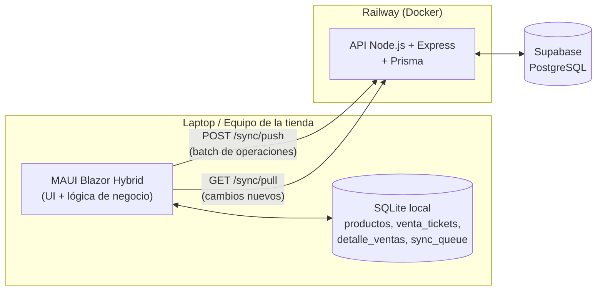
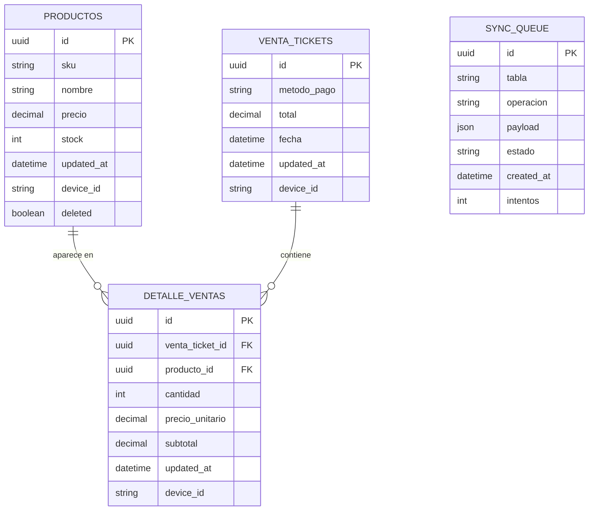
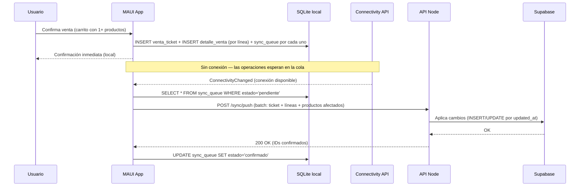
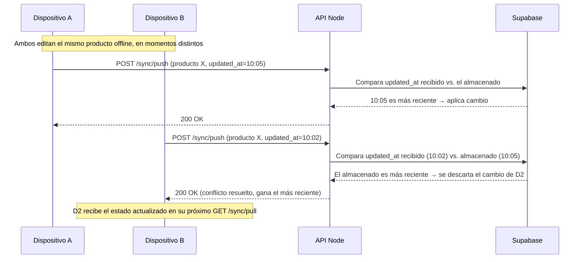
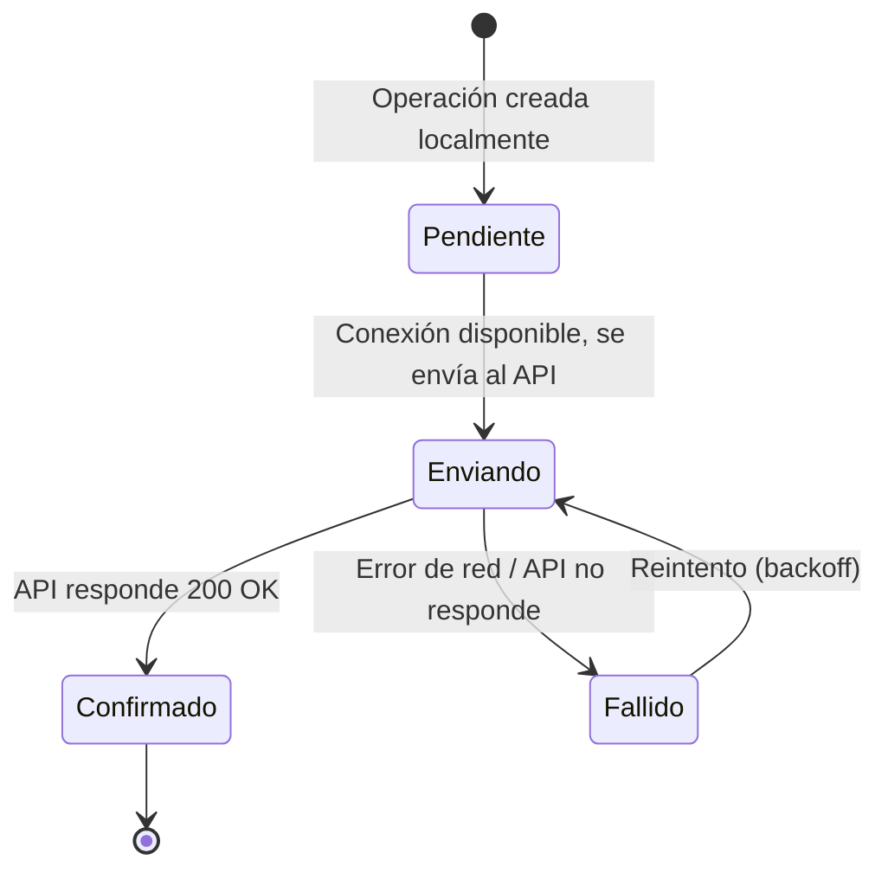
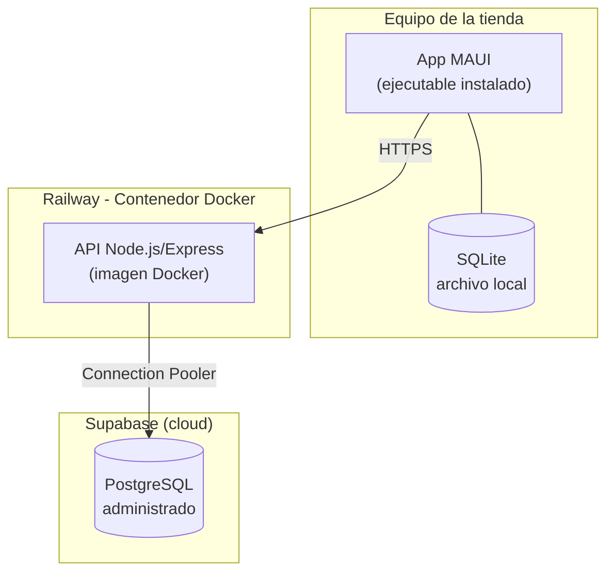

# Sistema de Gestión de Inventario y Ventas Fuera de Línea
### Documento de Especificación de Arquitectura

---

## 1. Introducción y Objetivo

Sistema híbrido escritorio + nube para tiendas locales que necesitan seguir operando (registrar ventas, consultar/ajustar inventario) aunque no tengan conexión a internet. Cuando la conexión regresa, los cambios locales se sincronizan automáticamente con una base de datos central en la nube.

El objetivo técnico del proyecto es demostrar:
- Sincronización de datos entre un cliente offline-first y un backend central.
- Manejo de estado local persistente y resiliente a fallos de red.
- Arquitectura básica de un sistema distribuido con resolución de conflictos.

---

## 2. Alcance (MVP)

**Incluido:**
- CRUD de productos (alta, edición de precio, adición de stock, baja lógica).
- Registro de ventas con **varios productos por venta** (carrito), agrupados en un ticket.
- Método de pago por venta (efectivo, transferencia, tarjeta).
- Funcionamiento 100% offline para todas las operaciones anteriores.
- Sincronización automática al detectar conexión.
- Resolución de conflictos por *last-write-wins*.

**Fuera de alcance (por ahora):**
- Multi-tienda / multi-sucursal con roles y permisos.
- Reportes avanzados o dashboards analíticos.
- Autenticación de usuarios robusta (se usa un token simple).
- Edición o cancelación de ventas ya registradas.

---

## 3. Requisitos Funcionales

| ID | Requisito |
|----|-----------|
| RF-01 | El usuario puede crear, editar (precio) y consultar productos sin conexión a internet. |
| RF-02 | El usuario puede agregar stock a un producto existente (operación acumulativa, no de reemplazo). |
| RF-03 | El usuario puede armar una venta con uno o varios productos (carrito) antes de confirmarla. |
| RF-04 | Cada venta registra un método de pago (efectivo, transferencia o tarjeta). |
| RF-05 | Al confirmar una venta, el stock de cada producto involucrado se descuenta localmente. |
| RF-06 | El sistema detecta automáticamente cuándo hay conexión disponible. |
| RF-07 | El sistema sincroniza automáticamente las operaciones pendientes al recuperar conexión. |
| RF-08 | El sistema resuelve conflictos de escritura concurrente (mismo registro editado en dos dispositivos) sin intervención manual. |
| RF-09 | El sistema no duplica operaciones si una sincronización se reintenta tras una falla parcial (idempotencia). |
| RF-10 | El historial de ventas se muestra agrupado por venta (ticket), con el detalle de productos disponible al expandir. |

## 4. Requisitos No Funcionales

| ID | Requisito |
|----|-----------|
| RNF-01 | La app debe responder de forma local (sin esperar red) para toda operación de negocio. |
| RNF-02 | La cola de sincronización debe sobrevivir a un cierre inesperado de la app (persistida en disco, no en memoria). |
| RNF-03 | El sistema debe reintentar sincronizaciones fallidas sin perder datos. |
| RNF-04 | El backend debe ser desplegable de forma reproducible (Docker). |
| RNF-05 | Los errores de sincronización deben mostrarse en lenguaje claro para el usuario final, no como excepciones técnicas. |
| RNF-06 | No se permiten valores negativos en precio ni en stock. |

---

## 5. Stack Tecnológico

| Capa | Tecnología | Motivo |
|------|-----------|--------|
| Cliente escritorio | .NET MAUI Blazor Hybrid (.NET 10) | Un solo lenguaje (C#) de punta a punta, sin necesidad de un bridge nativo↔JS. |
| Almacenamiento local | SQLite (`sqlite-net-pcl`) | Estándar para persistencia local embebida, transaccional. |
| Backend / API | Node.js + Express | Rápido de levantar, suficiente para el alcance del reto. |
| ORM backend | Prisma | Migraciones versionadas + types automáticos. |
| Base de datos en la nube | PostgreSQL (hosteado en Supabase) | Administrado, gratuito para este alcance, connection pooling incluido. |
| Contenerización | Docker | Despliegue reproducible del API. |
| Hosting del API | Railway | Deploy directo desde Dockerfile + repo de GitHub, URL pública gratis. |

---

## 6. Arquitectura de Contenedores

---

## 7. Modelo de Datos (ERD)

Una venta se modela como un **ticket** (encabezado) con una o varias **líneas de detalle**, una por producto — el mismo patrón que un recibo de compra real.

**Notas de diseño:**
- `device_id` en cada registro de negocio identifica qué dispositivo hizo el último cambio — necesario para resolver conflictos.
- `updated_at` es el criterio de *last-write-wins*.
- `deleted` en productos como borrado lógico en vez de `DELETE` físico, para que el borrado también se pueda sincronizar.
- `sync_queue.id` se genera como UUID en el cliente y viaja como identificador de idempotencia al backend — tanto para productos como para tickets y líneas de detalle.
- `metodo_pago` vive en el ticket (aplica a toda la venta), no en cada línea — una venta tiene un solo método de pago.

---

## 8. Flujo de Sincronización (Diagrama de Secuencia)

**Caso normal — offline a online:**

**Caso de conflicto — mismo producto editado en dos dispositivos:**

---

## 9. Ciclo de Vida de una Operación de Sincronización (Diagrama de Estados)

---

## 10. Diagrama de Despliegue

---

## 11. Estrategia de Resolución de Conflictos

- **Regla:** *Last-write-wins* basado en `updated_at`.
- **Justificación:** para el alcance del MVP (una tienda, pocos dispositivos), es simple de implementar y de explicar, y cubre el caso principal sin necesitar CRDTs o vector clocks.
- **Idempotencia:** cada operación en `sync_queue` lleva un UUID generado en el cliente; el API lo usa para detectar reenvíos duplicados (por ejemplo, si la conexión se cae a medio POST) y no aplicar el cambio dos veces. Aplica igual a productos, tickets y líneas de detalle.
- **Limitación conocida:** last-write-wins puede perder cambios legítimos si dos ediciones son casi simultáneas.

---

## 12. Interfaz de Usuario

Diseño pensado como software de punto de venta — no como dashboard genérico: legible, rápido de escanear, con jerarquía clara de números.

- **Sistema de color:** fondo gris claro, superficies blancas con borde sutil, azul como color de acento (`#2653D4`), verde/ámbar/rojo reservados para estados de stock.
- **Tipografía:** fuente nativa del sistema para la UI general; **tipografía monoespaciada** para precios, cantidades y SKUs (guiño al display de una caja registradora).
- **Layout:** sidebar fija con navegación (Productos / Ventas), barra superior con estado de sincronización en tiempo real (indicador de color + botón manual).
- **Productos:** tabla con badges de nivel de stock (ok / bajo / agotado), edición inline por fila.
- **Ventas:** carrito de productos antes de confirmar, selector de método de pago, historial agrupado por ticket con detalle expandible por producto.

---

## 13. Estado Actual y Próximos Pasos

**Completado:**
1. Arquitectura, requisitos y diagramas definidos.
2. Backend (Express + Prisma) con `/sync/push` y `/sync/pull`, probado end-to-end contra Supabase.
3. Cliente MAUI Blazor Hybrid con SQLite local, `sync_queue`, y sincronización automática por conectividad.
4. Flujo completo offline → online validado manualmente (agregar producto sin conexión, reconectar, confirmar en Supabase).
5. Rediseño de UI completo.
6. Modelo de ventas evolucionado de "una fila por producto" a "ticket + líneas de detalle", con método de pago.
7. Deploy del backend en Railway con URL pública.
8. Apuntar `AppConfig.cs` del cliente a la URL de producción.

**Pendiente:**
1. Iteraciones futuras de mejora sobre esta base ya desplegada.
